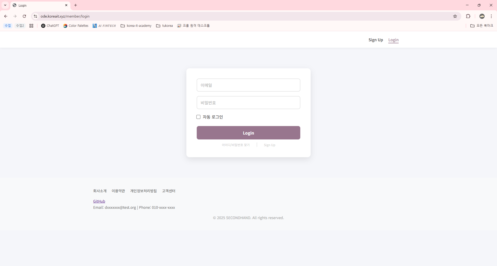
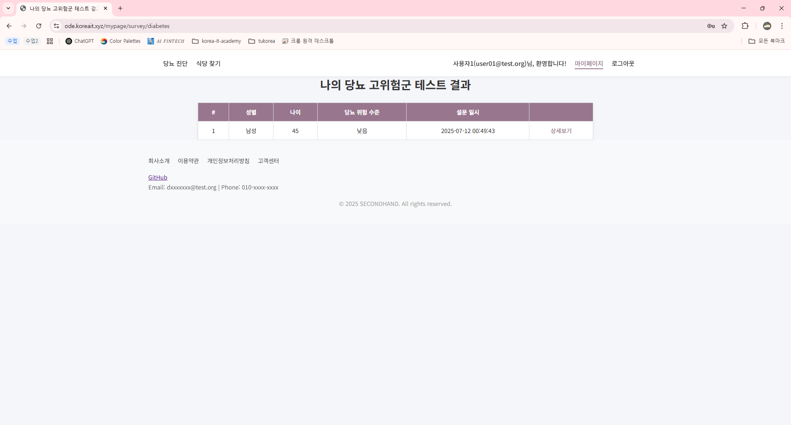
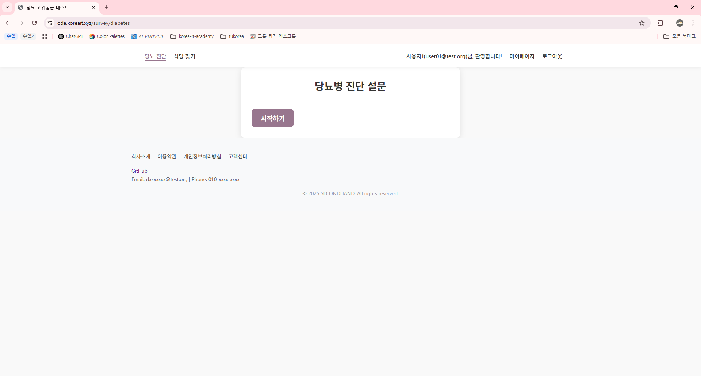
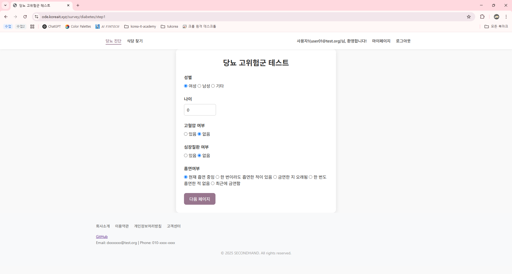
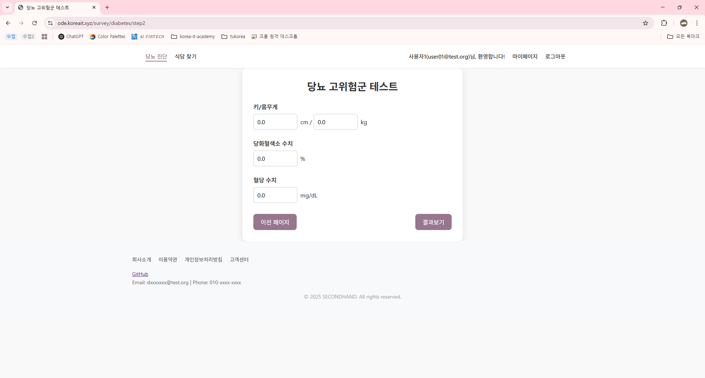
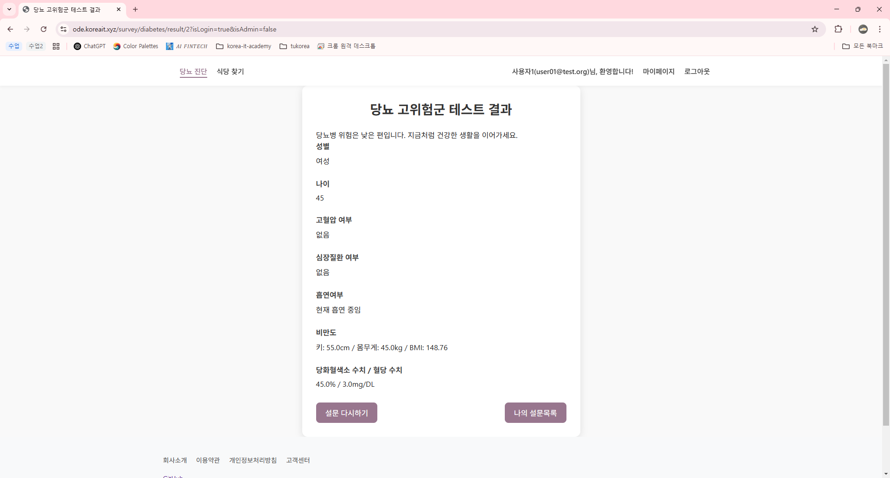
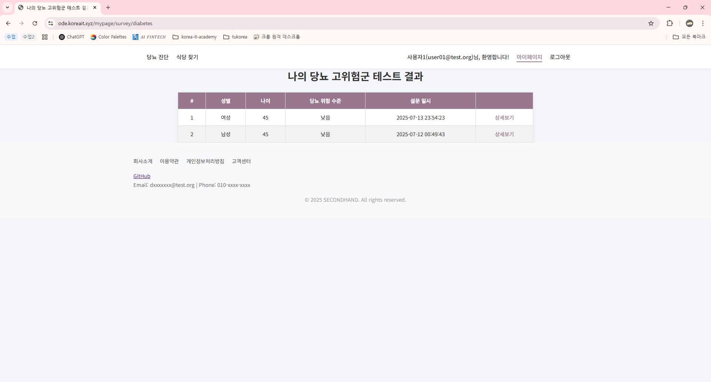

# 당뇨병 고위험군 설문 시스템

> Spring Boot 기반 설문 시스템으로, 사용자로부터 입력된 건강 정보에 따라 Python 모델을 활용하여 당뇨병 고위험 여부를 예측합니다.

---

## 📌 프로젝트 소개

당뇨병 설문 플랫폼

- 사용자 건강 정보 입력 (성별, 나이, 키, 몸무게, 혈당 등)
- 유효성 검사 및 설문 단계 분리 (step1, step2)
- Python 예측 모델 연동으로 고위험 여부 판단
- 설문 결과 저장 및 회원별 설문 이력 조회
- 관리자/일반 사용자 권한 분리

---

## ⚙️ 기술 스택

### 백엔드
- Java 17
- Spring Boot 3.x
- Spring Data JDBC
- Lombok
- Thymeleaf
- H2/MySQL (설정에 따라 선택 가능)

### 머신러닝
- Python 3.x
- Scikit-learn
- Pandas
- 예측 스크립트: `predict.py`

### 기타
- Gradle
- ModelMapper
- SessionAttribute 기반 다중 폼 처리

### 배포 Url
https://ode.koreait.xyz/survey/diabetes

---

## ✨ 주요 기능
- 회원 로그인 및 권한 확인
- 단계별 설문 입력 (step1 → step2)
- 폼 유효성 검증
- Python 모델과 연동한 예측 결과 처리
- 설문 결과 DB 저장 및 조회
- 회원별 설문 목록 제공 (mypage)
- ~~관리자 대시보드 (추후 개발 예정)~~

## 📸 스크린샷
- 로그인 페이지

- 마이페이지 (로그인 후 마이페이지로 이동)

- 설문 시작 페이지

- 설문 step1

- 설문 step2

- 최종 결과 페이지

- 마이페이지에서 확인하는 요약 정보 (링크 타고 최종 결과 페이지로 이동 가능)
